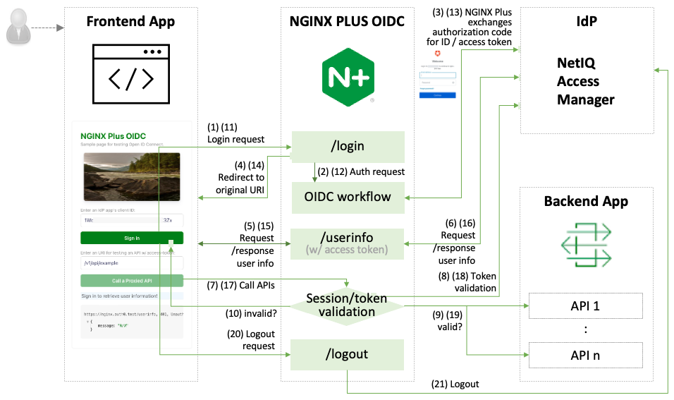

# nginx-netiq-access-manager

Reference implementation of NGINX Plus as relying party for OpenID Connect authentication w/ NetIQ Access Manager.

This repo provides the information of how to set up NetIQ Access Manager, integrate with NGINX Plus, and locally test using a containerized NGINX Plus app, a frontend OIDC simulation tool, and a NGINX Dev Portal.

- [Getting Started](#🏠-getting-started)
- [Troubleshooting](#🔧-troubleshooting)
- [References](#📚-references)

 

## 🏠 Getting Started

### Set up an identity provider (IdP)

- [TBD: Create and configure an app in NetIQ Access Manager]()

### Set up and Test a SSO application via NGINX Plus

- [Configure NGINX Plus OIDC](./docs/02-NGINX-Plus-Setup.md)
- [Locally Test an SSO app in a container ](./docs/03-Container-Test.md)

 

## 🔧 Troubleshooting

- [Common Troubleshooting for NGINX Plus OIDC](https://github.com/nginx-openid-connect/nginx-oidc-troubleshooting#-common-troubleshooting-for-nginx-oidc-and-all-idps)
- [TBD: Troubleshooting for NGINX Plus OIDC and NetIQ Access Manager]()

 

## 📚 References

- [NGINX OIDC Core v1.0: Forked from NGINX GitHub](https://github.com/nginx-openid-connect/nginx-oidc-core-v1)
- [NGINX OIDC Core v2.0: Forked from NGINX GitHub](https://github.com/nginx-openid-connect/nginx-oidc-core)
- [NGINX Plus: Single Sign-On With Keycloak](https://docs.nginx.com/nginx/deployment-guides/single-sign-on/keycloak/)
- [NGINX Management Suite](https://docs.nginx.com/nginx-management-suite/)
- [NGINX API Connectivity Manager](https://docs.nginx.com/nginx-management-suite/acm/)
